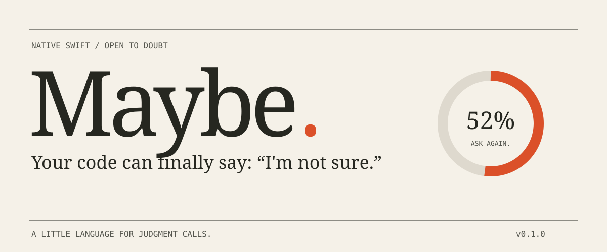
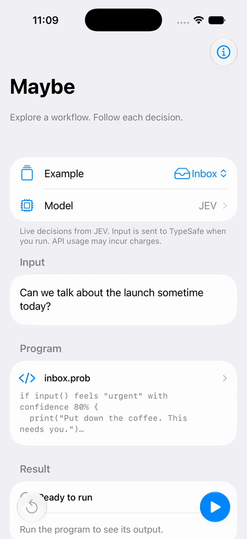

<p align="center">
  
</p>

<p align="center">
  <strong>A tiny Swift framework for programs that make judgment calls.</strong><br>
  Swift 6 · iOS 17+ · macOS 14+ · No package dependencies
</p>

```text
if message feels "urgent" with confidence 80% {
  print("Put the coffee down.")
} otherwise maybe {
  print("Ask one more question.")
} else {
  print("Keep the coffee.")
}
```

For seventy years, we have asked computers to pick `true` or `false`. Then we connected them to language models, which are considerably more like people with commitment issues.

**Maybe gives uncertainty a place in your app.**

Write a small workflow. Let a model judge a piece of text, pick a route, or rewrite a draft. Set a confidence threshold. Give the uncertain case its own branch. Save the whole run and replay it without asking the model again.

It is a native Swift implementation of the [Probably 0.1 language](https://probably-lang.southpolesteve.workers.dev/) using the `.prob` syntax as inspiration. 

## Try the part that says “maybe”

From this checkout, with a Swift 6 toolchain:

```sh
swift run maybe demo
```

The demo reads “We might need this soon.” Its simulated judgment is 52/48. Your 80% threshold sends it here:

```text
The model is squinting. Ask one more question.
```

Make the situation less ambiguous:

```sh
swift run maybe demo --input "URGENT: the server is down."
```

Save your moment of certainty. Revisit it for free:

```sh
swift run maybe demo --save run.json
swift run maybe replay run.json --trace
```

Replay uses the original source, input, model responses, and random draws. It makes **zero model calls**. You can debug yesterday's questionable decisions without paying for today's slightly different questionable decisions.

## Put it on an iPhone

Open [`Examples/MaybePlayground/MaybePlayground.xcodeproj`](Examples/MaybePlayground/MaybePlayground.xcodeproj), choose the **MaybePlayground** scheme and an iPhone simulator, then run. No signing account is needed for the simulator. The project already references this local package; XcodeGen is only needed if you edit the project specification.

The playground has three little experiments:

- **Inbox.** Urgent, unimportant, or sufficiently vague to warrant a conversation.
- **Rewrite.** Turn a sentence from the strategy deck into plain language.
- **Chaos.** Give the minority probability a chance. Replay the consequences.

Edit the code and input. Watch the decisions. Stop a run. Replay it. Share the JSON. Demo mode identifies simulated scores; select **Model** to connect directly to JEV with your own key. [Walkthrough and simulator instructions →](docs/demo.md)

[](docs/assets/maybe-jev-walkthrough.mp4)

*Real JEV call with synthetic input, followed by offline replay. Idle time is cut and an actual screenshot of the probabilities is held for readability. This is an edited walkthrough, not a latency benchmark.*

[Offline Demo walkthrough](docs/assets/maybe-walkthrough.mp4) · [Light](docs/assets/maybe-light.png) · [Dark](docs/assets/maybe-dark.png) · [Source editor](docs/assets/maybe-editor.png) · [JEV setup](docs/assets/maybe-jev-settings.png)

## About twelve lines of Swift

Add this folder as a local Swift package in Xcode, and link the **Maybe** library product. Or use a local dependency in another package:

```swift
// Package.swift
.package(path: "../Maybe") // Use the path where you placed this checkout.
// In the consuming target's dependencies:
.product(name: "Maybe", package: "Maybe") // The local package identity follows its folder.
```

Xcode can also add this package using `https://github.com/dejager/Maybe.git`.

```swift
import Maybe

let engine = Maybe(provider: DemoProvider())
let recording = try await engine.run(
    #"""
    if input() feels "urgent" with confidence 80% {
      print("On it.")
    } otherwise maybe {
      print("How soon do you need this?")
    } else {
      print("Tomorrow works.")
    }
    """#,
    input: "We might need this today."
)

print(recording.output)
let json = try recording.json()
let sameDecisions = try await engine.replay(Recording.decode(json))
```

Your app is Swift. A short string is the workflow. There's no JavaScript runtime, compiler service, or remote code execution hiding underneath it.

## What the language can do

| Construct | What happens |
| --- | --- |
| `let draft = input()` | Name a value. |
| `llm "Rewrite plainly." using draft` | Ask the text model for a string, using only that explicit context. |
| `if draft feels "clear"` | Ask the judgment provider for yes/no probabilities. |
| `with confidence 80%` | Require the winning answer to reach the threshold. |
| `otherwise maybe` | Handle an uncertain answer explicitly. |
| `match message { ... }` | Pick among 2–8 descriptions. |
| `while draft feels "full of jargon"` | Judge, rewrite, judge again. At most five iterations. |
| `repeat 3 { ... }` | Repeat without consulting the model. |
| `chaos { ... }` | Sample judgments from their probabilities. |
| `print(draft)` | Show a value. No model involved. |

An 80% threshold is symmetric: 90% yes takes the first branch, 90% no takes `else`, and 60/40 takes `otherwise maybe`. If you omit the maybe branch, uncertainty runs neither branch.

There are strings, numbers, and booleans. There are no arrays, arithmetic, functions, imports, or tool calls. This is a small language with a small job.
[The complete language guide →](docs/language.md)

## Bring your own judgment

The model boundary has exactly two methods:

```swift
public protocol ModelProvider: Sendable {
    func write(prompt: String, context: Value?) async throws -> String
    func judge(value: Value, labels: [String]) async throws -> [String: Double]
}
```

Use the provider that fits the setting:

| Provider | Use it for |
| --- | --- |
| `DemoProvider` | Learning, previews, tests, and screenshots. Deterministic simulation. |
| `ClosureProvider` | Wrapping a model service you already have in Swift. |
| `ProxyProvider` | Calling your app's authenticated HTTPS backend with a user token. |
| `JevProvider` | Direct JEV decisions using your TypeSafe API key. |

Connect from Swift with one credential:

```swift
let engine = Maybe(provider: try JevProvider(apiKey: userSuppliedAPIKey))
```

For a live CLI run, set `JEV_API_KEY` (or `TYPESAFE_API_KEY`) in your environment, then explicitly opt in:

```sh
swift run maybe run Examples/Programs/inbox.prob \
  --input "The checkout is down. Please investigate immediately." --live --trace
```

In the iPhone playground, tap **Model** to enter your own key. It stays in memory for the session; **Use Demo and Forget Key** removes it. Live calls can incur charges.

JEV makes decisions, not text. Inbox and Chaos work directly; `llm` expressions need an optional Swift `write:` function connected to your chosen text generator. No local AI model is bundled. Tests use fixtures and need no credentials. For apps using a shared developer key, keep that key on your backend and use `ProxyProvider`.
[Provider setup, exact HTTP contracts, and mock behavior →](docs/providers.md)

## The control flow is what you trust

A model supplies text or probabilities. The interpreter owns variables, branches, loops, budgets, and replay. It validates distributions, rejects malformed tapes, and refuses to keep looping forever because the model has “one more thought.”

A run has limits: **12 model calls, 200 statements, 90 seconds**, 12 nested blocks, and five iterations per semantic loop. Source and input are bounded, too. Cancellation follows Swift tasks. Custom providers must cooperate with it.

Events let your UI show the work as it happens:

```swift
let recording = try await engine.run(source, input: message) { event in
    // This callback is not on MainActor. Dispatch UI changes explicitly.
    print("Line \(event.line): \(event.text)")
}
```

Earlier events remain available if a later step fails. Recordings include the input and generated text, so the share button is also a data-sharing decision.
[Architecture, limits, and compatibility details →](docs/architecture.md)

## Why this exists

The interesting part of a language model app often fits between the model calls: when to trust the answer, when to try again, when to ask a person, and how to explain what just happened.

Those decisions should be visible in the code.

Maybe is an experiment in making them short enough to read, small enough to embed, and interesting enough that somebody tweets your work.

It is **not** an on-device implementation of Jev, a calibrated confidence system, or a production agent platform. The included HTTP adapters have contract tests. A direct JEV Inbox call and offline replay were verified on 2026-09-18; that smoke test is not a model-quality evaluation.

## Take it apart

```sh
swift test
swift build -c release
.build/release/maybe run Examples/Programs/jargon.prob \
  --input "Let's leverage synergies and circle back." --trace
```

The test suite covers the language, state, bounds, cancellation, HTTP contracts, and replay. An additional compatibility corpus contains **17 original synthetic recordings and 13 rejected programs**, checked against the original TypeScript
interpreter. The fixtures include full decision traces, not just the final line of output.

Start in [`Sources/Maybe/Maybe.swift`](Sources/Maybe/Maybe.swift) for execution, [`Parser.swift`](Sources/Maybe/Parser.swift) for grammar, or [`Providers.swift`](Sources/Maybe/Providers.swift) for model integration. [Contributing →](CONTRIBUTING.md)

## Credit where it is due

[Probably](https://probably-lang.southpolesteve.workers.dev/) supplied the language and the excellent premise. Maybe reimagines its documented 0.1 behavior in native Swift, with attribution rather than bundled upstream implementation code.

[Monogram](https://github.com/johnsoncodehk/monogram) informed the testing approach: check what a parser accepts **and** what it rejects against a reference. It is not a runtime dependency or a Swift generator used by this project.

Maybe's implementation is [Apache 2.0 licensed](LICENSE). Upstream projects retain their own terms. [Provenance and compatibility notes →](NOTICE.md)

---

*Finally, an `if` statement with the emotional range to say “let me get back to you.”*
