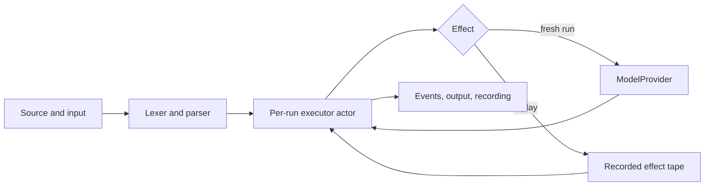

# How Maybe keeps its promises

The interpreter decides what executes. A provider supplies a string or an ordered
choice's probabilities. That separation makes the language testable without AI.



## Files worth reading

- `Types.swift`: values, JSON, errors, effects, events, recordings, and internal AST.
- `Lexer.swift` and `Parser.swift`: source positions, syntax and structural limits.
- `Maybe.swift`: scope, branching, loop budgets, effects, cancellation and replay.
- `Providers.swift`: demo, closure, HTTP transport, backend proxy and direct JEV.
- `Sources/MaybeCLI/CLI.swift`: argument handling and explicit live-mode configuration.
- `Examples/MaybePlayground`: editable SwiftUI demonstration of the same public API.

## Concurrency and cancellation

`Maybe` is Sendable and has no mutable per-run state. Each invocation creates its
own executor actor, keeping interpretation off MainActor and isolating variables,
trace, counters, and random draws between concurrent runs.

Events are synchronous callbacks on the executor. Dispatch UI work to MainActor.
The sample uses a run identity so late callbacks from a cancelled task cannot
alter a newer run; it cancels active work when the app backgrounds.

The 90-second deadline races execution in a throwing task group. Structured
concurrency cancels and waits for the other task. **A custom provider that ignores
cancellation can delay return beyond that deadline.** Built-in HTTP transports
cooperate with cancellation and also set a 25-second network deadline. An already
received remote request may still complete and incur a charge after local cancellation.

## Replay is executable evidence, not a signature

Recordings use the Probably version-1 JSON shape: `version`, `source`, `input`,
`tape`, `output`, `trace`. Tape entries have `kind`, `args`, `result`, and optionally
`draw`. Generation effects retain the `write` name even when source uses `llm`.

Replay reparses source, matches effect kind and structural arguments in order,
validates results and chaos draws, consumes the entire tape, and recomputes output
and trace. It never invokes a provider. Object key order does not matter; string
arguments use exact UTF-16 equality so normalization cannot hide altered input.

Output and trace stored in a file are not trusted inputs. Nor is the file signed:
somebody can deliberately change source, input, and responses together. A change
that never reaches an effect may go undetected. Use recordings to debug a run,
not to prove what a service actually said.

The import helper caps recordings at 32 MiB (enough for escaped output and its duplicated trace
from a maximum-budget run). HTTP adapters cap response bodies at
1 MB and generated strings at the language limit. All recorded content is user
data; do not silently upload it to analytics or check in real personal input.

## Compatibility: test both sides

The checked-in oracle corpus contains original synthetic programs run through the
upstream interpreter with a deterministic test provider: 17 complete successful
runs plus 13 rejected programs. Swift replays each tape without a model and compares
output, trace, and effects. The native tests also exercise invalid syntax, scoping,
probability normalization, request shapes, cancellation and budget exhaustion.

To regenerate, obtain the source separately from the original Probably site, then:

```sh
bun scripts/generate-oracle-fixtures.ts /path/to/upstream/src/runtime.ts
swift test
```

Bun is a development tool for this optional compatibility check and workflow reports.
It is not required to build, use or test the Swift framework.

Intentional differences from the reference:

- Non-finite numeric literals are rejected. They cannot round-trip through standard JSON.
- Invalid Unicode surrogate escapes are rejected because Swift strings must be valid Unicode.
- Canonically equivalent match descriptions (composed/decomposed Unicode) count as duplicates
  under Swift Dictionary equality. Use labels that differ in meaning, not normalization.
- Invalid optional random draws are rejected even outside chaos, and unsupported recording
  versions are rejected explicitly.
- Replay compares structured objects rather than serialized key ordering.

Monogram's conformance approach informed the corpus. Its current portable parser
targets do not include Swift, and Maybe's small grammar does not need a generator
dependency. If editor integrations expand, a shared grammar could become useful.

## Extending the framework

For a new model: implement `ModelProvider`, or use `ClosureProvider`, and test the
shape of returned probabilities. Changing the model can change calibration and
therefore workflow behavior even when the interface is identical.

For a new keyword: update the lexer/parser and AST, then the executor, language guide,
and both acceptance and rejection cases. Do not quietly turn generated text into code.

For a production app: provide authentication, quotas, privacy controls, and model
selection on your backend. The included `ProxyProvider` defines a small wire contract;
it does not deploy or operate that backend for you.
